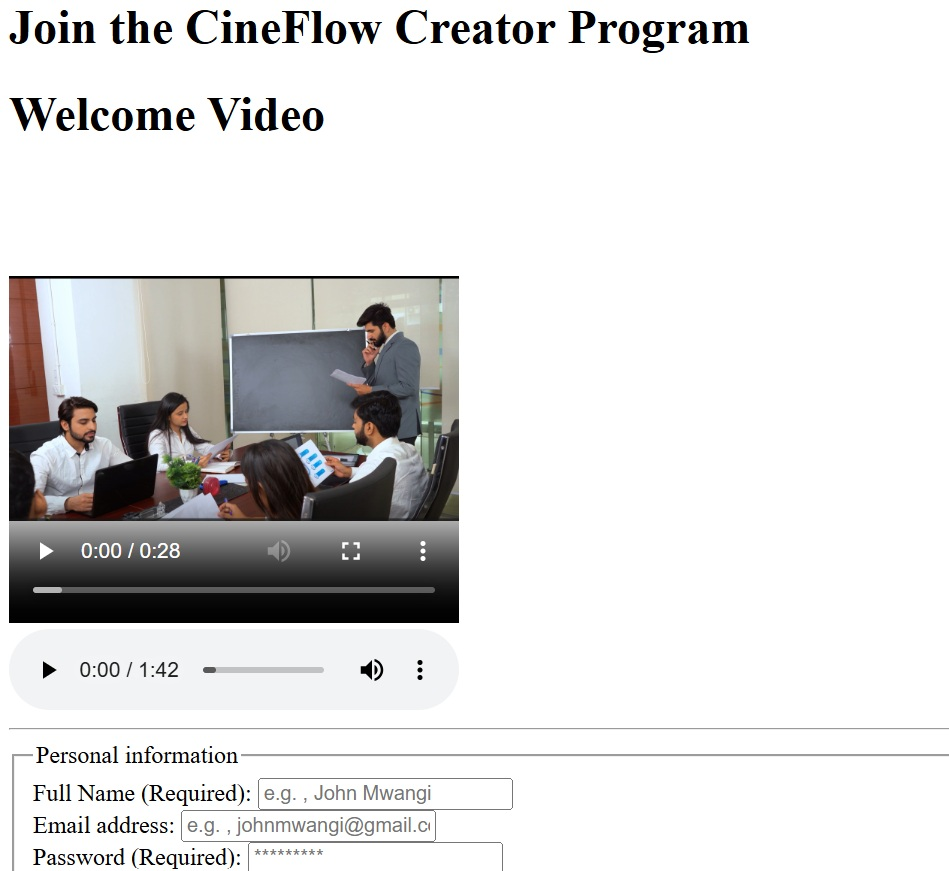

CineFlow Account
---
### 1. Project Brief

The CineFlow Account project is a modern, responsive registration portal designed for creators to join a high-end digital media program. It features seamless multimedia integration.

### 2. Business Rationale

In a competitive content creation market, a strong digital presence is essential. CineFlow addresses two key business needs:

- Brand Authority: A professional design establishes trust and positions the platform as the premium provider.

- Data Collection: The structured form ensures that creator details, niche preferences and media requirements are captured accurately on any device.
### 3. Technologies used

- HTML5: Semantic structure for SEO and accessibility.
- Git/Github: version control and feature-based branching.

### 4. Accessibility features

- Semantic HTML: Using header, main, section and fieldset tags for screen readers
- Responsive images: Ensuring all images have descriptive alt tags


### 5. Embeded media
The project includes the following media assets to engage user engagement:
* `promo.jpg`: Visual representation of CineFlow brand and video poster.
- `promo5.mp4`: Backgound promotional video.
- `promo.mp3`: High quality audio introduction.


### 6. Git workflow


- **Fork the Repository:** Create your own copy of the project to work on.
- **Create a Feature Branch:** 

```bash
git checkout -b YourFeatureName
```

- **Commit Your Changes**
- **Push to branch:** 

```bash 
git push origin feature/YourFeatureName
```

- **Open a Pull Request(PR):** Describe your changesclearly and link the related issues.


### 7. Set up instructions

a. Clone this repository on your local machine.
```bash
git clone https://github.com/rollingsmajiwa/CineFlow_Account.git
cd CineFlow_Account.git
```

b. Ensure you have the media files.

c. Open 'index.html' in any browser.

### 8. Screenshots



### 9. Author
**Rollings Majiwa**

* GitHub: [https://https://github.com/rollingsmajiwa]
* Email: [rollingsmajiwa@gmail.com]

### Get started
Interested in the code behind CineFlow Account? You can reach me directly via my profile or open an issue for collaboration.
[**Visit my Github profile**](https://github.com/rollingsmajiwa)

